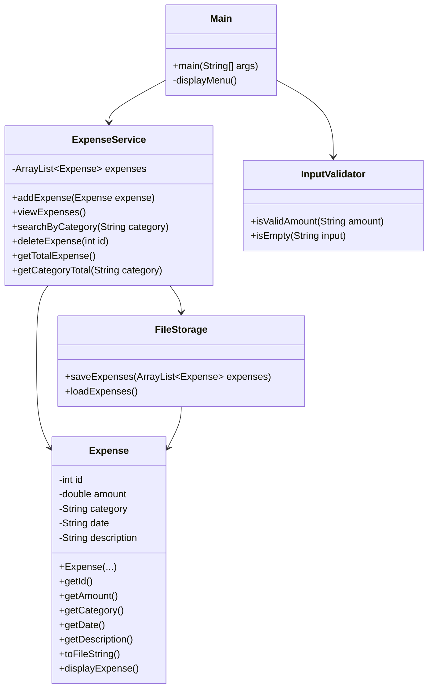

# Class Diagram

```mermaid
classDiagram

class Main {
    +main(String[] args)
    -displayMenu()
}

class Expense {
    -int id
    -double amount
    -String category
    -String date
    -String description
    +Expense(...)
    +getId()
    +getAmount()
    +getCategory()
    +getDate()
    +getDescription()
    +toFileString()
    +displayExpense()
}

class ExpenseService {
    -ArrayList~Expense~ expenses
    +addExpense(Expense expense)
    +viewExpenses()
    +searchByCategory(String category)
    +deleteExpense(int id)
    +getTotalExpense()
    +getCategoryTotal(String category)
}

class FileStorage {
    +saveExpenses(ArrayList~Expense~ expenses)
    +loadExpenses()
}

class InputValidator {
    +isValidAmount(String amount)
    +isEmpty(String input)
}

Main --> ExpenseService
Main --> InputValidator
ExpenseService --> Expense
ExpenseService --> FileStorage
FileStorage --> Expense
```