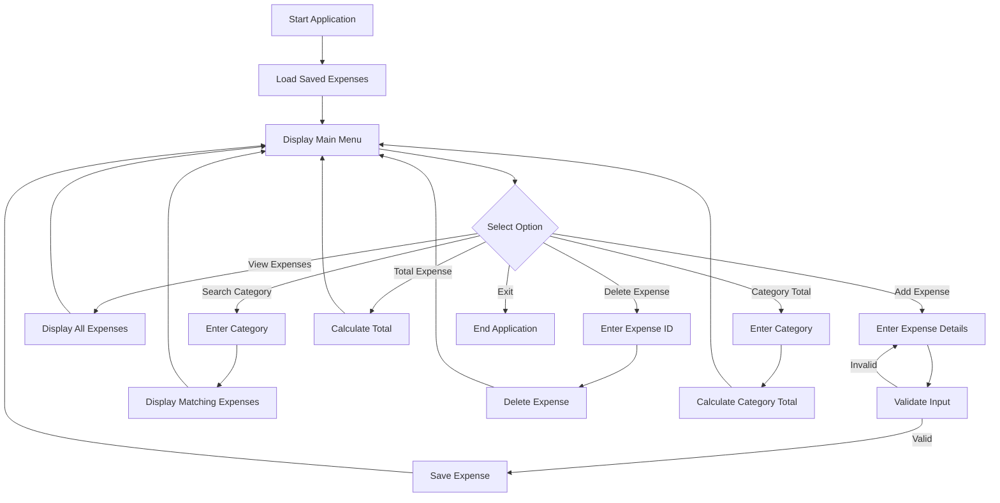

# System Design

## 1. Architecture

The Personal Expense Tracker follows a modular architecture.

```text
User
  |
  v
Main.java
  |
  v
ExpenseService.java
  |
  +----------------------+
  |                      |
  v                      v
Expense.java       InputValidator.java
  |
  v
FileStorage.java
  |
  v
data/expenses.txt
```

## 2. Module Description

### Main.java

- Displays the menu
- Accepts user input
- Calls the required service methods
- Displays results and messages

### Expense.java

- Represents one expense
- Stores ID, amount, category, date, and description

### ExpenseService.java

- Adds expenses
- Displays expenses
- Searches by category
- Deletes expenses
- Calculates total expenses
- Calculates category-wise expenses

### FileStorage.java

- Saves expenses into a file
- Loads expenses when the application starts

### InputValidator.java

- Checks empty input
- Checks whether the amount is valid
- Helps prevent incorrect data

## 3. Application Workflow



## 4. Data Storage Design

Each expense is stored in the following format:

```text
id|amount|category|date|description
```

Example:

```text
1|250.0|Food|2026-09-17|Lunch
```

## 5. Input and Output

### Inputs

- Menu choice
- Expense amount
- Expense category
- Expense date
- Expense description
- Expense ID

### Outputs

- Expense list
- Search results
- Total expenses
- Category-wise total
- Success messages
- Error messages

## 6. Error Handling

The application handles:

- Invalid menu choices
- Empty category or description
- Invalid amount
- Invalid expense ID
- Missing data file
- Incorrectly formatted stored records