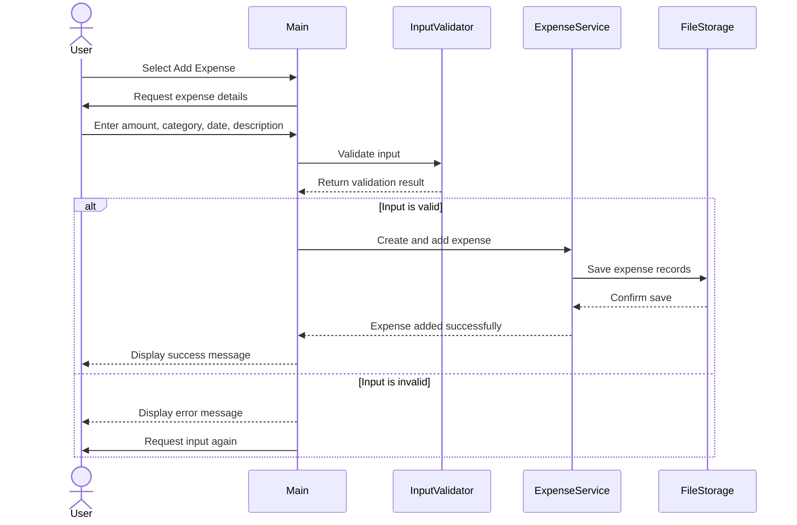

# Sequence Diagram

## Add Expense Workflow

```mermaid
sequenceDiagram
    actor User
    participant Main
    participant Validator as InputValidator
    participant Service as ExpenseService
    participant Storage as FileStorage

    User->>Main: Select Add Expense
    Main->>User: Request expense details
    User->>Main: Enter amount, category, date, description
    Main->>Validator: Validate input
    Validator-->>Main: Return validation result

    alt Input is valid
        Main->>Service: Create and add expense
        Service->>Storage: Save expense records
        Storage-->>Service: Confirm save
        Service-->>Main: Expense added successfully
        Main-->>User: Display success message
    else Input is invalid
        Main-->>User: Display error message
        Main->>User: Request input again
    end
```