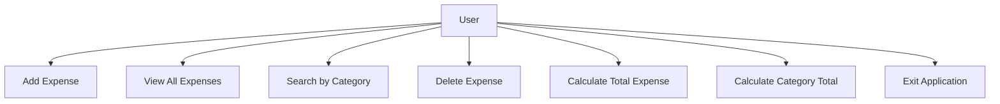

# Use Case Diagram

## Actors

- User

## Use Cases

- Add Expense
- View All Expenses
- Search Expense by Category
- Delete Expense
- Calculate Total Expense
- Calculate Category Total
- Exit Application

